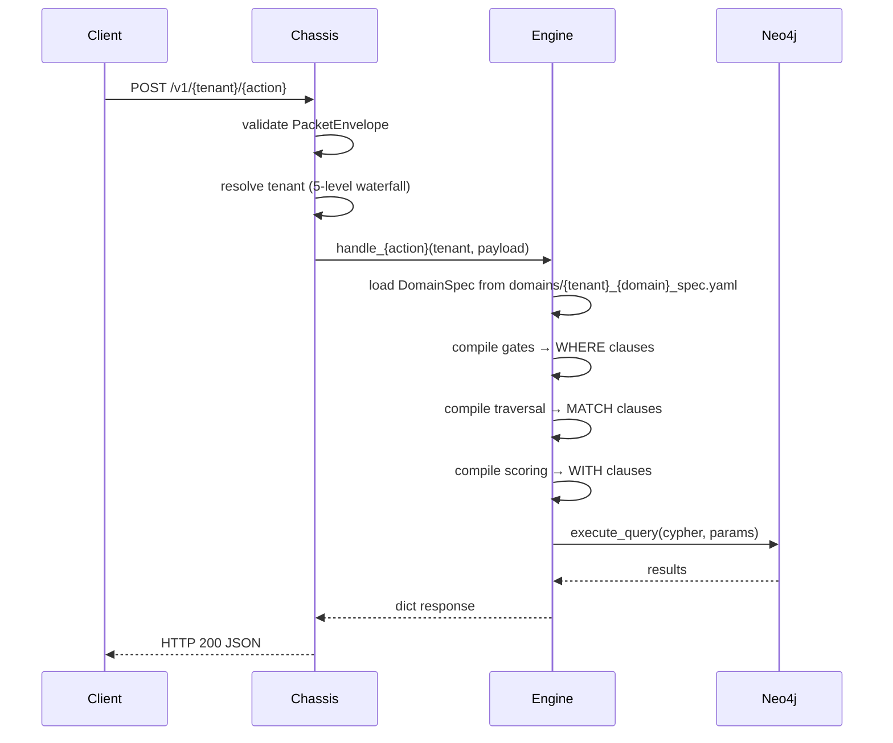

<!-- L9_META
l9_schema: 1
origin: audit-corrected
engine: graph
layer: [architecture, runtime]
tags: [execution, flows, lifecycle]
owner: platform
status: active
/L9_META -->

# EXECUTION_FLOWS.md — CEG Runtime Execution Paths

**Purpose**: Documents runtime paths, entrypoints, control flow, and lifecycle sequences.

**Last Verified**: SHA 358d15d (2026-04-02)

---

## HTTP Request Flow

**Correct Entry Point**: `POST /v1/{tenant}/{action}`



**Source**: ARCHITECTURE.md request flow (SHA: 8635bd1)

**8 Action Handlers** (engine/handlers.py):
1. `handle_match` — Core matching pipeline (gates + scoring + traversal)
2. `handle_sync` — Bi-directional entity synchronization
3. `handle_admin` — Administrative operations (domain reload, cache clear)
4. `handle_outcomes` — Outcome recording for feedback loop
5. `handle_resolve` — Entity resolution and deduplication
6. `handle_health` — AI readiness scoring
7. `handle_healthcheck` — Liveness/readiness probe
8. `handle_enrich` — Entity enrichment pipeline

---

## Tenant Resolution (5-Level Waterfall)

```
1. X-Tenant-ID header → if present, use directly
2. Subdomain extraction → {tenant}.api.domain.com
3. API key prefix → key format: {tenant}_live_abc123
4. PacketEnvelope.tenant_context → if packet has tenant metadata
5. Default tenant → L9_DEFAULT_TENANT env var (fallback)
```

**Contract**: C-003 (Tenant Isolation) — tenant resolved BY chassis, engine receives as string

---

## Initialization Sequence (engine/boot.py)

```python
# 8-step startup sequence
1. Load environment variables → Settings singleton
2. Connect to Neo4j → GraphDriver.create()
3. Load all domain specs → DomainPackLoader.load_all()
4. Assert scoring weight sum ≤ 1.0 → _assert_default_weight_sum()
5. Initialize GDS scheduler → GDSScheduler.start() (if gds_enabled=True)
6. Register action handlers → register_all()
7. Health check → GraphDriver.verify_connectivity()
8. Emit startup event → structlog.info("startup_complete")
```

**Health check readiness criteria**:
- Neo4j connectivity verified
- At least 1 domain spec loaded successfully
- All required env vars present (L9_ prefix validation)

---

## Feedback / Convergence Cycle

**Triggers when**: `feedback_enabled=True` AND outcome recorded via `handle_outcomes`

```
Outcome recorded → fingerprint stored → ConvergenceLoop.trigger():

  ScorePropagator:
    → boost/penalize matching configurations based on outcome
    → update DimensionWeight nodes in Neo4j

  SignalWeightCalculator:
    → lift formula: (positive_rate / base_rate) with 95% confidence interval
    → write learned weights to Neo4j DimensionWeight nodes

  CounterfactualGenerator:
    → generate alternative scenarios for negative outcomes
    → "what if we had used different gates/scoring?"

  DriftDetector:
    → χ² divergence check against historical distribution
    → alert if scoring distribution shifts >threshold

  ScoringAssembler.load_learned_weights():
    → final_weight = spec_weight × learned_weight
    → next match query uses updated weights
```

**Source**: ARCHITECTURE.md feedback/convergence cycle (SHA: 8635bd1)

**Contract**: C-021 (Feature Flag Discipline) — feedback loop gated by `feedback_enabled` flag

---

## CI Pipeline (7 Phases)

**Source**: .github/workflows/ci.yml (SHA: 108781d)

### Phase 1: Validation
- Check Python syntax (all .py files)
- Validate YAML files (.github/workflows/*.yml)

### Phase 2: Lint & Type Check
- Ruff linter (`ruff check`)
- Ruff formatter (`ruff format --check`)
- Mypy type checker (non-blocking warnings)

### Phase 3: Test Suite
- Pytest with coverage (`pytest --cov`)
- Minimum coverage: 60% (CI), 70% (pyproject.toml), 95% (engine/gates/, engine/scoring/)
- PostgreSQL service (postgres:16)
- Redis service (redis:7-alpine)

### Phase 4: Security Scanning
- Gitleaks (secret detection)
- pip-audit (dependency vulnerabilities, non-blocking)
- Safety (vulnerability scanner, non-blocking)
- Bandit (SAST, non-blocking)

### Phase 5: SBOM Generation
- Anchore SBOM action (spdx-json format)

### Phase 6: OpenSSF Scorecard
- Security posture scoring

### Phase 7: CI Gate (Fan-In)
- **Blocking**: validate, lint, test (must pass)
- **Advisory**: security, sbom, scorecard (failures logged, not blocking)

---

## Pre-Commit Hooks (15 hooks)

**Source**: .pre-commit-config.yaml

1. `trailing-whitespace` — remove trailing whitespace
2. `end-of-file-fixer` — ensure newline at EOF
3. `check-yaml` — validate YAML syntax
4. `check-added-large-files` — reject files >500KB
5. `check-merge-conflict` — detect merge conflict markers
6. `mixed-line-ending` — enforce LF line endings
7. `ruff` — Python linting
8. `ruff-format` — Python formatting
9. `mypy` — type checking (strict mode)
10. `block-fastapi-in-engine` — enforce C-001 (custom hook)
11. `check-cypher-interpolation` — enforce C-009 (custom hook)
12. `contract-scanner` — run tools/contract_scanner.py
13. `verify-contracts` — run tools/verify_contracts.py
14. `l9-meta-check` — verify L9_META headers (C-018)
15. `gitleaks` — secret scanning

**Exclusions**:
- `test_gates_all_types.py` — requires mock updates
- `test_scoring.py` — requires mock updates  
- `test_config.py` — requires mock updates

---

## Error / Failure Flows

### Neo4j Circuit Breaker Trip
```
GraphDriver detects: 3 failures within 30s window
  → Circuit opens (all queries rejected immediately)
  → Return error: {"status": "error", "code": "circuit_open"}
  → After 30s: half-open state (single test query)
  → If test succeeds: circuit closes
  → If test fails: circuit stays open, retry in 30s
```

### Redis Timeout
```
Cache operation exceeds 5s timeout
  → Log warning with tenant + operation
  → Fall back to direct Neo4j query (bypass cache)
  → Return result to client (degraded but functional)
```

### Domain Spec Validation Failure
```
DomainPackLoader.load() → Pydantic ValidationError
  → Log error with spec file path + validation errors
  → Skip loading this domain spec
  → Continue with other domain specs
  → Health endpoint returns: {"status": "degraded", "reason": "domain_X_invalid"}
```

### Prohibited Factor Compilation Error
```
GateCompiler detects prohibited field (age, gender, etc.)
  → Raise ProhibitedFactorError at compile time
  → Log audit event: {"tenant", "gate_spec", "prohibited_field", "timestamp"}
  → Return 400 to client: {"status": "error", "code": "prohibited_factor"}
  → Do NOT compile Cypher (fail early)
```

---

## Background Job Flows (GDS Scheduler)

**When**: `gds_enabled=True` AND domain spec declares `gds_jobs`

```
APScheduler reads spec.gds_jobs:
  - schedule: cron | manual
  - algorithm: louvain | similarity | pagerank | ...
  - projection: {node_labels: [...], edge_types: [...]}
  - write_property: "community_id" | "similarity_score" | ...

Cron job triggers:
  1. Create graph projection (if not exists)
  2. Execute GDS algorithm on projection
  3. Write results to Neo4j properties
  4. Log completion: {"algorithm", "duration", "nodes_affected"}
  5. Optional: trigger re-scoring if feedback_enabled=True
```

**Manual trigger**: `make gds-trigger JOB=louvain DOMAIN=plasticos`

---

## Unknown Flows

The following execution paths are undocumented in the fetched repository files:

1. **Neo4j read query patterns**: Exact Cypher templates for entity lookups
2. **PostgreSQL access**: Purpose and schema unknown (CI uses postgres:16 service)
3. **KGE training pipeline**: CompoundE3D training triggers and data flow
4. **Memory substrate writes**: Packet storage and embedding generation

**Agent Action**: If working in these subsystems, request additional documentation from Founder.

---

## Related Documents

- **ARCHITECTURE.md** — Source for request flow and feedback cycle
- **GUARDRAILS.md** — Safety rules referenced in error flows
- **.github/workflows/ci.yml** — CI pipeline phases
- **.pre-commit-config.yaml** — Pre-commit hook list
- **engine/boot.py** — Initialization sequence implementation
- **engine/handlers.py** — Handler registration
