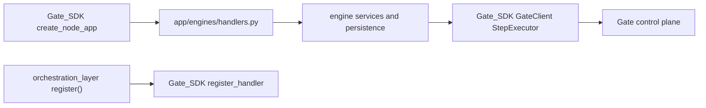

# Transport SDK Cutover Plan

## Assumptions

- Default assumption 1: direct cutover, not a long-lived compatibility shim.
- Revised assumption 2: `Gate_SDK` is broader than the original plan assumed. It exports `create_node_app`, runtime preflight/lifecycle helpers, `register_handler`, `execute_transport_packet`, `TransportPacket`, `GateClient`, and `StepExecutor`.
- Revised assumption 2a: lock one canonical package name and import surface before implementation. The repository name is `Gate_SDK`, but the observed Python import surface is `constellation_node_sdk`; the migration plan must use one naming convention consistently.
- Revised assumption 3: the default target should be SDK-owned node runtime for `/v1/execute`, `/v1/health`, and `/metrics`, not merely swapping the local router import.
- Revised assumption 4: the current handler contract is closer to SDK-compatible than expected. The SDK examples accept `async def handle(_tenant, payload) -> dict`, with optional `packet: TransportPacket` for orchestrated flows, so a mass rewrite of all business handlers is not the first step.
- Revised assumption 5: outbound node-to-node traffic must be reworked as Gate-only egress. Any plan that only deletes `chassis/` but leaves direct node URL routing in place is incomplete.
- Revised assumption 6: the current app uses OpenTelemetry (`setup_telemetry(app)`) and `/api/v1/health`, not an existing Prometheus `/metrics` route or `/v1/health`; the plan must explicitly decide whether SDK runtime observability replaces, augments, or coexists with the current service observability model.

## Current State Summary

- The original plan understated the scope. `Gate_SDK` is a full node-runtime repo, not just a transport helper package. Its public API includes `create_node_app`, runtime execution/registration, transport models, security validation, `GateClient`, and orchestrator helpers.
- Engine business logic still already sits behind handler functions in [app/engines/handlers.py](/Users/ib-mac/Dropbox/Repo_Dropbox_IB/Enrichment.Inference.Engine/app/engines/handlers.py), which remains the right long-term execution surface.
- There are two PacketEnvelope implementations today: [chassis/envelope.py](/Users/ib-mac/Dropbox/Repo_Dropbox_IB/Enrichment.Inference.Engine/chassis/envelope.py) and [app/engines/chassis_contract.py](/Users/ib-mac/Dropbox/Repo_Dropbox_IB/Enrichment.Inference.Engine/app/engines/chassis_contract.py). The SDK cutover should remove both as first-class implementations.
- There are more transport touchpoints than the first plan captured:
  - inbound edge in [app/api/v1/chassis_endpoint.py](/Users/ib-mac/Dropbox/Repo_Dropbox_IB/Enrichment.Inference.Engine/app/api/v1/chassis_endpoint.py)
  - bootstrap in [app/main.py](/Users/ib-mac/Dropbox/Repo_Dropbox_IB/Enrichment.Inference.Engine/app/main.py)
  - handler registration in [app/engines/orchestration_layer.py](/Users/ib-mac/Dropbox/Repo_Dropbox_IB/Enrichment.Inference.Engine/app/engines/orchestration_layer.py)
  - direct node dispatch in [app/engines/graph_sync_client.py](/Users/ib-mac/Dropbox/Repo_Dropbox_IB/Enrichment.Inference.Engine/app/engines/graph_sync_client.py) and [app/engines/packet_router.py](/Users/ib-mac/Dropbox/Repo_Dropbox_IB/Enrichment.Inference.Engine/app/engines/packet_router.py)
  - a second local handler-registry path in [app/services/chassis_handlers.py](/Users/ib-mac/Dropbox/Repo_Dropbox_IB/Enrichment.Inference.Engine/app/services/chassis_handlers.py)
  - graph return-channel docs and registration assumptions in [app/services/graph_return_channel.py](/Users/ib-mac/Dropbox/Repo_Dropbox_IB/Enrichment.Inference.Engine/app/services/graph_return_channel.py)
- The “parallel registries” problem is worse than duplication alone: [app/services/chassis_handlers.py](/Users/ib-mac/Dropbox/Repo_Dropbox_IB/Enrichment.Inference.Engine/app/services/chassis_handlers.py) defines `register_all_handlers()`, but that path is not wired from [app/main.py](/Users/ib-mac/Dropbox/Repo_Dropbox_IB/Enrichment.Inference.Engine/app/main.py) or [app/engines/orchestration_layer.py](/Users/ib-mac/Dropbox/Repo_Dropbox_IB/Enrichment.Inference.Engine/app/engines/orchestration_layer.py), so some packet actions appear to be dead rather than merely duplicated.
- Current outbound wire formats are inconsistent. [app/engines/graph_sync_client.py](/Users/ib-mac/Dropbox/Repo_Dropbox_IB/Enrichment.Inference.Engine/app/engines/graph_sync_client.py) builds one PacketEnvelope-like shape, [app/engines/packet_router.py](/Users/ib-mac/Dropbox/Repo_Dropbox_IB/Enrichment.Inference.Engine/app/engines/packet_router.py) builds another, and [chassis/router.py](/Users/ib-mac/Dropbox/Repo_Dropbox_IB/Enrichment.Inference.Engine/chassis/router.py) expects its own ingress semantics. The revised plan must converge these to one canonical TransportPacket flow.

## Precise File Fate Matrix

- Remove and replace with SDK runtime or SDK imports:
  - [chassis/__init__.py](/Users/ib-mac/Dropbox/Repo_Dropbox_IB/Enrichment.Inference.Engine/chassis/__init__.py)
  - [chassis/router.py](/Users/ib-mac/Dropbox/Repo_Dropbox_IB/Enrichment.Inference.Engine/chassis/router.py)
  - [chassis/registry.py](/Users/ib-mac/Dropbox/Repo_Dropbox_IB/Enrichment.Inference.Engine/chassis/registry.py)
  - [chassis/envelope.py](/Users/ib-mac/Dropbox/Repo_Dropbox_IB/Enrichment.Inference.Engine/chassis/envelope.py)
  - [chassis/node_client.py](/Users/ib-mac/Dropbox/Repo_Dropbox_IB/Enrichment.Inference.Engine/chassis/node_client.py)
  - [chassis/lifecycle.py](/Users/ib-mac/Dropbox/Repo_Dropbox_IB/Enrichment.Inference.Engine/chassis/lifecycle.py)
- Replace with SDK runtime ownership or reduce to service-only composition:
  - [app/api/v1/chassis_endpoint.py](/Users/ib-mac/Dropbox/Repo_Dropbox_IB/Enrichment.Inference.Engine/app/api/v1/chassis_endpoint.py): no longer assume this stays. Under the revised default, `/v1/execute` should come from `create_node_app`; this file either disappears or shrinks to non-SDK extras like `/v1/outcomes` if that route remains app-specific.
  - [app/main.py](/Users/ib-mac/Dropbox/Repo_Dropbox_IB/Enrichment.Inference.Engine/app/main.py): newly in scope. The plan must decide whether the base `FastAPI` app is replaced by SDK app creation and then augmented with service-specific routers, middleware, and lifespan hooks.
- Keep, but rewire through the SDK:
  - [app/engines/orchestration_layer.py](/Users/ib-mac/Dropbox/Repo_Dropbox_IB/Enrichment.Inference.Engine/app/engines/orchestration_layer.py): keep orchestration behavior, replace local handler registration, and remove assumptions about direct peer routing.
  - [app/services/graph_return_channel.py](/Users/ib-mac/Dropbox/Repo_Dropbox_IB/Enrichment.Inference.Engine/app/services/graph_return_channel.py): keep domain behavior, but retarget any chassis registration language or wiring to SDK runtime registration if still needed.
- Keep as engine-local business logic:
  - [app/engines/handlers.py](/Users/ib-mac/Dropbox/Repo_Dropbox_IB/Enrichment.Inference.Engine/app/engines/handlers.py)
  - `result_store`, convergence/enrichment services, KB resolution, and other domain logic outside transport.
- Keep only if re-expressed in Gate-only terms; otherwise remove or redesign:
  - [app/engines/graph_sync_client.py](/Users/ib-mac/Dropbox/Repo_Dropbox_IB/Enrichment.Inference.Engine/app/engines/graph_sync_client.py): current direct `graph_url` + `/v1/execute` model conflicts with the SDK’s Gate-only outbound rule and must be replaced or fundamentally redesigned around `GateClient`.
  - [app/engines/packet_router.py](/Users/ib-mac/Dropbox/Repo_Dropbox_IB/Enrichment.Inference.Engine/app/engines/packet_router.py): current peer URL routing and fire-and-forget dispatch are in direct tension with the SDK architecture and need a dedicated migration step.
- Collapse or delete after choosing the canonical SDK surface:
  - [app/engines/chassis_contract.py](/Users/ib-mac/Dropbox/Repo_Dropbox_IB/Enrichment.Inference.Engine/app/engines/chassis_contract.py): prefer deletion or a very short compatibility facade while TransportPacket migration is in flight.
  - [app/services/chassis_handlers.py](/Users/ib-mac/Dropbox/Repo_Dropbox_IB/Enrichment.Inference.Engine/app/services/chassis_handlers.py): likely remove or merge, because it is a second in-repo handler registry that duplicates runtime responsibilities and may currently be unwired dead code.
  - [chassis/middleware.py](/Users/ib-mac/Dropbox/Repo_Dropbox_IB/Enrichment.Inference.Engine/chassis/middleware.py): likely remove; the SDK runtime already owns execution, readiness, and observability concerns.

## Execution Sequence

## 1. Lock the SDK boundary

- Identify the exact SDK symbols that replace the current local API surface.
- Revised parity target should cover:
  - `create_node_app(...)` and runtime config/lifecycle exports
  - `register_handler(...)`, `registered_actions(...)`, and execution flow
  - `TransportPacket`, packet creation helpers, and validation/signing
  - `GateClient` and `StepExecutor` for outbound and orchestrated work
- Add a wire-format inventory before editing code:
  - every current producer of PacketEnvelope-like payloads
  - exact JSON shape each producer emits
  - exact runtime path that consumes it today
  - exact SDK TransportPacket replacement path
- Explicitly choose the target adoption mode before implementation:
  - preferred: SDK runtime becomes the canonical `/v1/execute` and `/v1/health` owner
  - fallback: temporary compatibility layer wraps SDK execution inside the existing app
- Do not create a new long-lived in-repo `chassis` compatibility package.
- Add a merge-gate matrix here: forbid landing any intermediate state that mixes new SDK runtime ownership with old PacketEnvelope helpers or leaves direct peer routing live for production flows.

## 2. Cut the inbound runtime over to the SDK

- Replace the current local chassis boundary with SDK runtime ownership.
- Bring [app/main.py](/Users/ib-mac/Dropbox/Repo_Dropbox_IB/Enrichment.Inference.Engine/app/main.py) into scope to decide how the SDK app and existing service routers compose.
- Preserve service-owned capabilities that are not transport runtime concerns:
  - domain enrichment routes such as `/api/v1/enrich`, `/api/v1/enrich/batch`, converge, discover, and fields
  - repo-specific startup for KB loading, persistence, convergence wiring, and service emitters
  - app-specific auth behavior where still required outside the SDK runtime
- Add a route-ownership table before implementation:
  - `/v1/execute`
  - `/v1/outcomes`
  - `/api/v1/health`
  - SDK `/v1/health`
  - SDK `/metrics`
- Decide how current app-level middleware and observability compose with the SDK runtime:
  - `RateLimitMiddleware`
  - `setup_telemetry(app)`
  - any SDK-owned logging/metrics hooks
- Re-evaluate the fate of [app/api/v1/chassis_endpoint.py](/Users/ib-mac/Dropbox/Repo_Dropbox_IB/Enrichment.Inference.Engine/app/api/v1/chassis_endpoint.py):
  - delete if SDK runtime fully owns `/v1/execute`
  - keep only for non-SDK extra routes such as `/v1/outcomes`, if still needed
- Lock startup ordering explicitly:
  - when handlers must be registered relative to SDK app creation
  - whether registration occurs before app return or in lifespan before `yield`
  - how first-request races are prevented

## 3. Cut startup registration over to the SDK

- Update [app/engines/orchestration_layer.py](/Users/ib-mac/Dropbox/Repo_Dropbox_IB/Enrichment.Inference.Engine/app/engines/orchestration_layer.py) to register handlers via the SDK.
- Keep the engine-owned action map identical during cutover:
  - `enrich`
  - `enrichbatch`
  - `converge`
  - `discover`
  - `simulate`
  - `writeback`
  - `enrich_and_sync`
- Audit secondary registration paths at the same time:
  - [app/services/chassis_handlers.py](/Users/ib-mac/Dropbox/Repo_Dropbox_IB/Enrichment.Inference.Engine/app/services/chassis_handlers.py)
  - [app/services/graph_return_channel.py](/Users/ib-mac/Dropbox/Repo_Dropbox_IB/Enrichment.Inference.Engine/app/services/graph_return_channel.py)
- Preserve business actions, but do not preserve duplicate registries.
- Add an action-registration audit table:
  - action name
  - current implementation file
  - current live registration site
  - target SDK registration site
  - disposition: keep, merge, or delete
- Explicitly resolve the duplicated `handle_graph_inference_result` path between [app/services/chassis_handlers.py](/Users/ib-mac/Dropbox/Repo_Dropbox_IB/Enrichment.Inference.Engine/app/services/chassis_handlers.py) and [app/services/graph_return_channel.py](/Users/ib-mac/Dropbox/Repo_Dropbox_IB/Enrichment.Inference.Engine/app/services/graph_return_channel.py).

## 4. Replace PacketEnvelope with TransportPacket

- Delete the local transport implementation files in [chassis/](/Users/ib-mac/Dropbox/Repo_Dropbox_IB/Enrichment.Inference.Engine/chassis).
- Remove PacketEnvelope as a first-class transport contract and migrate to SDK `TransportPacket`.
- Resolve duplicate envelope paths by preferring deletion over facades:
  - [chassis/envelope.py](/Users/ib-mac/Dropbox/Repo_Dropbox_IB/Enrichment.Inference.Engine/chassis/envelope.py)
  - [app/engines/chassis_contract.py](/Users/ib-mac/Dropbox/Repo_Dropbox_IB/Enrichment.Inference.Engine/app/engines/chassis_contract.py)
- Update any code or tests that still assume local inflate/deflate helpers, PacketEnvelope naming, or response wrapping done outside the SDK runtime.

## 5. Rework outbound traffic to Gate-only egress

- Bring these files explicitly into the migration scope because the SDK architecture prohibits direct peer routing:
  - [app/engines/graph_sync_client.py](/Users/ib-mac/Dropbox/Repo_Dropbox_IB/Enrichment.Inference.Engine/app/engines/graph_sync_client.py)
  - [app/engines/packet_router.py](/Users/ib-mac/Dropbox/Repo_Dropbox_IB/Enrichment.Inference.Engine/app/engines/packet_router.py)
  - [app/core/config.py](/Users/ib-mac/Dropbox/Repo_Dropbox_IB/Enrichment.Inference.Engine/app/core/config.py) and any config/docs that still use `graph_node_url`, `score_node_url`, `route_node_url`, or peer-node URL assumptions
- Replace direct node URL execution with Gate-routed patterns using SDK `GateClient` and, where orchestration is needed, `StepExecutor`.
- Audit orchestration flows that currently know peer destinations or call `/v1/execute` on another node directly:
  - graph sync
  - score invalidation
  - outcome feedback
- Preserve the business intent of these flows, but move the routing authority out of ENRICH and into Gate.
- Add delivery-semantics decisions for the current fire-and-forget paths:
  - retry semantics
  - idempotency requirements
  - observability and failure recording
  - whether any flow must be temporarily disabled until Gate wiring exists
- Add a peer-rollout dependency checklist so ENRICH is not migrated ahead of Graph/Score/Gate capabilities that the new path assumes.

## 6. Retarget tests to the SDK-backed runtime

- Update [tests/unit/test_orchestration_layer.py](/Users/ib-mac/Dropbox/Repo_Dropbox_IB/Enrichment.Inference.Engine/tests/unit/test_orchestration_layer.py) so registration and execution assertions target SDK runtime behavior, not local `chassis.registry` or `chassis.router`.
- Replace [tests/contracts/test_packet_envelope_contract.py](/Users/ib-mac/Dropbox/Repo_Dropbox_IB/Enrichment.Inference.Engine/tests/contracts/test_packet_envelope_contract.py) with TransportPacket contract tests; do not leave it as a skip-based remnant after `chassis/` removal.
- Update or delete [tests/unit/test_chassis_contract.py](/Users/ib-mac/Dropbox/Repo_Dropbox_IB/Enrichment.Inference.Engine/tests/unit/test_chassis_contract.py) based on whether any thin facade remains.
- Add or retarget tests around the revised runtime boundary in [app/main.py](/Users/ib-mac/Dropbox/Repo_Dropbox_IB/Enrichment.Inference.Engine/app/main.py) if SDK app composition changes bootstrap ownership.
- Rewrite or replace existing direct-routing tests, not just add new ones. Explicitly include:
  - [tests/test_pr21_packet_router.py](/Users/ib-mac/Dropbox/Repo_Dropbox_IB/Enrichment.Inference.Engine/tests/test_pr21_packet_router.py)
  - [tests/integration/test_gap_fixes.py](/Users/ib-mac/Dropbox/Repo_Dropbox_IB/Enrichment.Inference.Engine/tests/integration/test_gap_fixes.py)
  - [tests/services/test_contract_enforcement.py](/Users/ib-mac/Dropbox/Repo_Dropbox_IB/Enrichment.Inference.Engine/tests/services/test_contract_enforcement.py)
  - [tests/services/test_graph_return_channel.py](/Users/ib-mac/Dropbox/Repo_Dropbox_IB/Enrichment.Inference.Engine/tests/services/test_graph_return_channel.py)
  - [tests/contracts/tier2/test_enforcement_packet_runtime.py](/Users/ib-mac/Dropbox/Repo_Dropbox_IB/Enrichment.Inference.Engine/tests/contracts/tier2/test_enforcement_packet_runtime.py)
  - [tests/compliance/test_architecture.py](/Users/ib-mac/Dropbox/Repo_Dropbox_IB/Enrichment.Inference.Engine/tests/compliance/test_architecture.py)
  - [tests/contracts/test_openapi_contract.py](/Users/ib-mac/Dropbox/Repo_Dropbox_IB/Enrichment.Inference.Engine/tests/contracts/test_openapi_contract.py)
- Revisit path-based governance tests and rule references that name `chassis/`, especially [tests/contracts/tier2/test_l9_contract_control.py](/Users/ib-mac/Dropbox/Repo_Dropbox_IB/Enrichment.Inference.Engine/tests/contracts/tier2/test_l9_contract_control.py).
- Include contract fixtures and constitution checks in the migration:
  - `tests/contracts/fixtures/*packet*`
  - [tests/contracts/tier2/test_node_constitution_contract.py](/Users/ib-mac/Dropbox/Repo_Dropbox_IB/Enrichment.Inference.Engine/tests/contracts/tier2/test_node_constitution_contract.py)
  - [tests/contracts/tier2/test_enforcement_authority.py](/Users/ib-mac/Dropbox/Repo_Dropbox_IB/Enrichment.Inference.Engine/tests/contracts/tier2/test_enforcement_authority.py)

## 7. Clean codegen, docs, and policy references

- Update architecture and governance references that describe `chassis/` as an in-repo transport library.
- Update contract language from PacketEnvelope to `TransportPacket` where the SDK becomes source of truth.
- Update docs and config that assume direct peer node URLs, especially `graph_node_url`-style routing or generic node clients.
- Review workflow or CI files that bucket `chassis/` paths so they do not point at deleted files.
- Remove the stale `codegen/templates/handlers.py.j2` reference from the plan itself; it does not exist in this repo.
- Add explicit cleanup targets for contracts, governance config, and verification scripts:
  - `docs/contracts/agents/protocols/packet-envelope.yaml`
  - `config/contracts/repository_contract_pairs.yaml`
  - `tools/verify_contracts.py`
  - `tools/l9_enrichment_manifest.yaml`
  - `local_pr_pipeline/contract_bound_local.py`
  - `.github/pr_review_config.yaml`
  - `INVARIANTS.md`, `AGENT.md`, `REPO_MAP.md`, `docs/AI_AGENT_REVIEW_CHECKLIST.md`, `docs/CODERABBIT.md`
- Decide the fate of `gap-fixes-sdk/` explicitly so the repo does not keep both prototype SDK-oriented code and production app code as parallel sources of truth.

## 8. Validation and closure

- Run a targeted validation slice covering:
  - SDK runtime `/v1/execute` dispatch
  - `TransportPacket` validation and response wrapping
  - handler registration and optional packet-aware execution
  - Gate-only outbound orchestration behavior
  - any remaining outcome-feedback endpoint behavior
- After tests pass, verify there are no remaining runtime imports from `chassis` and no remaining direct peer-node `/v1/execute` calls outside approved SDK Gate abstractions.
- Update [workflow_state.md](/Users/ib-mac/Dropbox/Repo_Dropbox_IB/Enrichment.Inference.Engine/workflow_state.md) and the GMP report with the architectural cutover decision, removed files, retained adapters, and validation evidence.
- Add explicit acceptance criteria:
  - `rg 'from chassis\\.|import chassis' app tests` returns no runtime usage except intentionally documented temporary shims
  - `rg 'inflate_ingress|deflate_egress|PacketEnvelope' app tests` returns only approved legacy docs or temporary compatibility scaffolding
  - no direct `httpx` or similar peer-node POSTs to configured Graph/Score/Route `/v1/execute` remain outside approved Gate abstractions
  - OpenAPI and route ownership are consistent for `/v1/execute`, `/v1/outcomes`, and health endpoints
  - CI passes after updating repository-contract and constitution enforcement scripts, not just unit tests
- Add rollback criteria:
  - define whether rollback is revert-only or uses a short-lived compatibility switch
  - define what cannot land independently on `main`
  - define peer-service readiness required before enabling Gate-only production flows

## Target Architecture

## Risks to control

- Partial migration risk is higher than first assumed because the SDK docs explicitly warn against mixing PacketEnvelope and TransportPacket.
- Direct peer-routing leftovers in [app/engines/graph_sync_client.py](/Users/ib-mac/Dropbox/Repo_Dropbox_IB/Enrichment.Inference.Engine/app/engines/graph_sync_client.py) and [app/engines/packet_router.py](/Users/ib-mac/Dropbox/Repo_Dropbox_IB/Enrichment.Inference.Engine/app/engines/packet_router.py) would leave the architecture non-compliant even if `chassis/` is deleted.
- Duplicate registry paths such as [app/services/chassis_handlers.py](/Users/ib-mac/Dropbox/Repo_Dropbox_IB/Enrichment.Inference.Engine/app/services/chassis_handlers.py) can silently preserve old dispatch semantics unless they are explicitly retired or merged.
- Test drift remains a risk if assertions keep targeting deleted local implementation details instead of the SDK-backed runtime and Gate abstractions.
- Documentation drift will be severe unless governance files are updated from PacketEnvelope/local chassis language to TransportPacket/Gate-runtime language.
- Startup-order bugs are a specific risk because handler registration currently happens in app lifespan; the plan must prevent a first-request window where SDK runtime is live before handlers are registered.
- Observability drift is a specific risk because the current app uses OTLP/OpenTelemetry and `/api/v1/health`, while the SDK introduces its own runtime health/metrics model.
